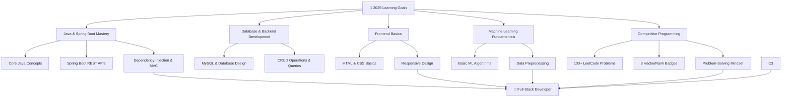

# Hello This is Srija A

<div align="center">
  


</div>

<div align="center">
  
</div>

## 🌟 About Me

<table align="center">
<tr>
<td width="55%">

### 🎯 **Who Am I?**
```
public class Srija A {
    String title = "Backend Developer & ML Enthusiast";
    String education = "B.Tech IT @ SRM Institute of Science & Technology";
    int graduationYear = 2026;
    String currentRole = "Backend Developer";
    String[] expertise = {"Java", "SpringBoot", "DSA"};
    
    Achievements achievements = new Achievements();

    String motto = "Write Code That Matters, Build What Inspires.";

    static class Achievements {
        String leetcodeProblems = "100+ 🔥";
        boolean hackerRank = true;
        int projectsBuilt = 2;
    }
}
```

</td>
<td align="left" width="45%">

# 📊 Quick Highlights
🎯 **Spring Boot Specialist** — Crafting Modern APIs & UIs

🤖 **ML Enthusiast** — Building AI-Powered Solutions

🎨 **Design-Focused** — Prioritizing User Experience

⚡ **Performance Optimizer** — Delivering Fast & Scalable Apps

</td>
</tr>
</table>

---

## ⚡ Tech Stack & Expertise

<div align="center">


### 🔧 **Backend & Database**
<p>
  
</p>


### 🛠️ **Tools & Platforms**
<p>
  
</p>

### 🔮 **Currently Mastering**
<p>
  
</p>

</div>

---
## 📊 GitHub Analytics & Achievements

<div align="center">
  <table>
    <tr>
      <td width="50%">
        
      </td>
 
<td width="50%">
  
</td>
    </tr>
    <tr>
      <td width="50%">
        
      </td>
      <td width="50%">
        
      </td>
    </tr>
  </table>
</div>


<div align="center">
  
</div>

---

## 🚀 Featured Projects Portfolio

<div align="center">

### 🎯 **Flagship Projects**

<table>
<tr>
<td width="50%" align="center">

# 🎓 University Syllabus Management – Backend Service
Robust backend API powering syllabus management for university departments, semesters, subjects, and syllabi


Tech Stack:

<p>  
  
  
   </p>
  
# Key Features:

⚙️ Complete CRUD APIs for Departments, Semesters, Subjects, and Syllabi

📂 File upload support with syllabus image retrieval

🚀 Layered Spring Boot architecture for scalability and maintainability

🧪 Fully tested with Postman; ready for frontend integration

💾 Uses in-memory H2 DB for fast prototyping, easy migration to MySQL/PostgreSQL

Future Plans: Add Swagger docs, JWT security, unit tests, and CI/CD automation

[💻 Code](https://github.com/Srija-A-12/university-syllabus-backend)


</td>
<td width="50%" align="center">

# 🎓 Elective Recommendation System
Flask-based academic elective recommender leveraging NLP and Microsoft Phi-2 LLM for personalized course suggestions


Tech Stack:

<p>  
  
   
   
   </p>
  
# Key Features:

🔍 Parses queries for semester, domain, and category preferences

📊 Filters electives from a curated dataset

🧠 Uses Microsoft Phi-2 transformer for natural language generation

💻 Interactive Flask web interface

# My Role:

🏆 Led project development and paper submission

💡 Conceptualized recommendation logic and dataset curation

🔍 Researched and integrated large language model

🛠 Developed regex-based query parsing and model integration

Impact: Personalized elective recommendations to enhance academic planning

[💻 Code](https://github.com/Srija-A-12/Subject-Genie-)


</td>
</tr>
</table>


</div>

---

## 💡 Skills & Expertise Breakdown

<div align="center">

| ☕ **Java & Spring Boot**      | 🛢️ **MySQL**                     | 🌐 **Frontend Basics**           | 🧠 **ML Fundamentals**              | 🏅 **Competitive Programming**      |
| ----------------------------- | --------------------------------- | -------------------------------- | ----------------------------------- | ----------------------------------- |
| 📚 Core Java concepts         | 🗄️ Database design & queries     | 🖥️ HTML & CSS 3 basics          | 🤖 Basics of Machine Learning       | 🥇 3 HackerRank badges              |
| ⚙️ Spring Boot REST APIs      | ✍️ CRUD operations                | 🎨 Responsive web design         | 📊 Intro to ML algorithms           | 💯 100+ problems solved on LeetCode |
| 🔗 Dependency Injection & MVC | 🔍 Joins, indexing, normalization | 🎯 Styling and layout techniques | 🧩 Understanding data preprocessing | 🧠 Problem-solving mindset          |


</div>

---

## 📈 Coding Activity & Statistics

<div align="center">

### 📊 **Weekly Development Breakdown**
```text
Skill           Weekly Progress         Hours This Week
☕ Java         ████████████░░░░░░░░     12 hrs          
🌱 Spring Boot  ██████████░░░░░░░░░░     10 hrs          
🛢️ MySQL        ████████░░░░░░░░░░░░     7 hrs           
🌐 HTML & CSS   ████░░░░░░░░░░░░░░░░     4 hrs           
🧠 ML Basics    ███░░░░░░░░░░░░░░░░░     3 hrs           
💻 LeetCode     ████████████████████     15+ problems    
🥉 HackerRank  🥉🥈🥇 (earned badges)   Ongoing         

```

### 🏆 **Achievement Highlights**
- 🔥 **100+ Coding Problems** on LeetCode
- ⭐ **250+ problems** across platforms
- 🎯 **HackerRank 3-Star** in Problem Solving

</div>

---

## 🎯 Learning Roadmap & Goals

<div align="center">



</div>

# 🎯 My 2025 Learning Objectives

☕ **Master Spring Boot** — Complete 4+ real-world projects

💻 **Solve 500+ LeetCode problems** — Level up problem-solving skills

🤖 **Learn Machine Learning & NLP algorithms** — Build intelligent systems

🎨 **Improve UI/UX design skills** — Create user-friendly and attractive interfaces

---

## 🏆 Achievements & Certifications

<div align="center">
  <table>
    <tr>
      <td align="center" width="33%">
        
        <br><strong>Problem Solver</strong>
      </td>
      <td align="center" width="33%">
        
        <br><strong>Consistent Coder</strong>
      </td>
    
  </table>
</div>

---

## 🌐 Connect & Collaborate

<div align="center">

### 💬 **Let's Build Something Amazing Together!**

<p>
  <a href="www.linkedin.com/in/srija-a-09a1a3333/">
    
  </a>
  <a href="mailto:srijaadusumalli02@gmail.com">
    
  </a>
</p>

### 🚀 **Coding Platforms**
<p>
  <a href="https://leetcode.com/u/Vac1VCukar/">
    
  </a>
  <a href="https://www.hackerrank.com/profile/Srija_A12">
    
  </a>
  <a href="https://www.codechef.com/users/blest_zest_02">
    
  </a>
</p>

### 🤝 **Open For:**
- 💼 **Freelance Projects** - Web Development & ML Solutions
- 🚀 **Startup Collaborations** - Building MVPs & Products
- 🌟 **Open Source Contributions** - Java & SpringBoot Projects
- 👥 **Mentorship** - Helping fellow developers grow

</div>

---

## 🌟 Personal Philosophy & Fun Facts

<div align="center">
  <table>
    <tr>
      <td align="center" width="50%" style="padding: 20px;">
        <h3>💡 My Coding Philosophy</h3>
        <em>"Code is more than instructions — it’s a story we tell machines to bring ideas to life."</em>
        <br><br>
        🚀 Build with purpose — every feature solves a real problem<br>
        🎯 Strive for simplicity — clean, readable, maintainable<br>
        🤖 Embrace automation — tests, CI/CD, and tooling<br>
        🌍 Think globally — accessible and inclusive software<br>
        📈 Keep evolving — adapt, learn, and improve constantly
      </td>
      <td align="center" width="50%" style="padding: 20px;">
        <h3>🎉 Life Beyond Coding</h3>
        🌿 Nature lover & gardener<br>
        📚 Voracious reader<br>
        ✍️ Poet & storyteller<br>
        🎵 Music lover & explorer<br>
        🤝 Community builder & mentor<br>
        ❤️ Social work advocate
      </td>
    </tr>
  </table>
</div>


---

## 📊 Profile Analytics

<div align="center">
  


### 🎯 **GitHub Insights**


### 💫 **Daily Motivation**
 <blockquote style="font-style: italic; margin-top: 15px;">
    "Eight ounces of discipline outweighs tons of regret."
  </blockquote>
</div>

---

<div align="center">
  
  
  ### ⭐ **"Turning caffeine into code, one commit at a time"** ⭐
  
  <sub>🚀 **Available for exciting opportunities** • 💡 **Open to collaborations** • 🌟 **Always ready to learn**</sub>
  
  ---
  

  
  *Last updated: July 2025*
</div>
